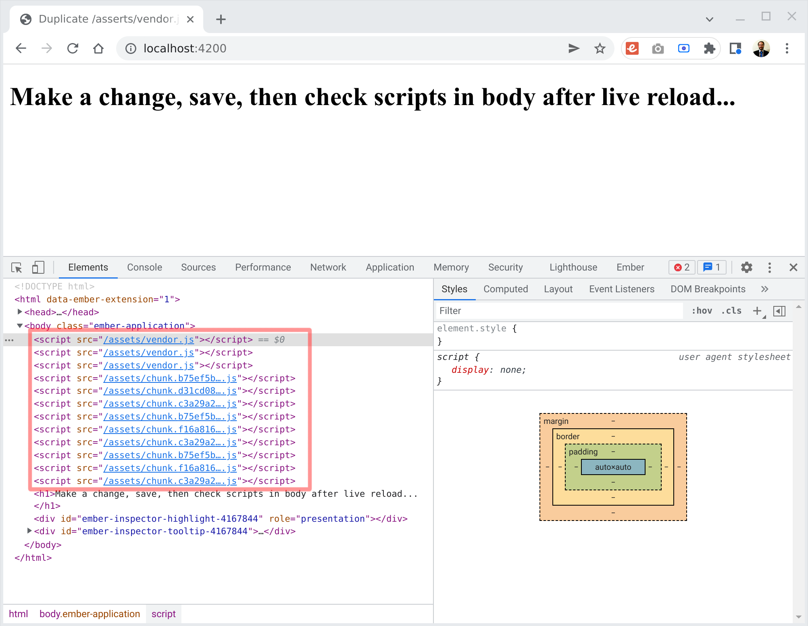
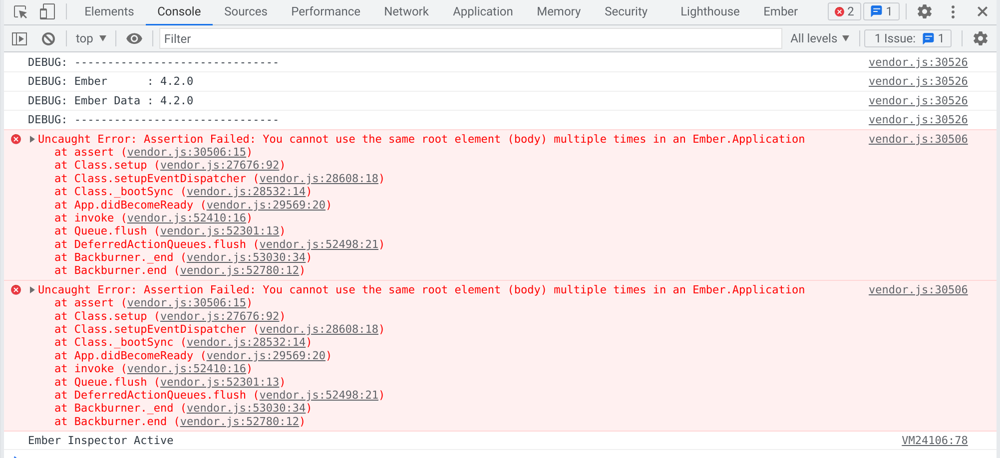

# Embroider live-reload bug repro

See https://github.com/embroider-build/embroider/issues/1211

Steps to reproduce:

1. Checkout this repository's `broken` tag
2. `npm install` (presumably `yarn` will also work)
3. `ember s`
4. View basically empty app working in web browser via local server (http://localhost:4200)
5. Edit `app/templates/application.hbs` (e.g. add some whitespace) then save it
6. Watch in dev tools as scripts like `vendor.js` now appear twice
   (change, save, and reload again to see them appear more than twice)

